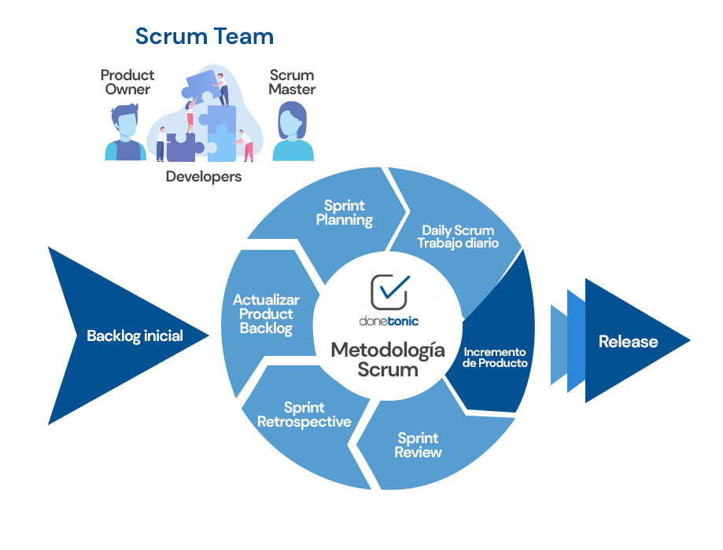
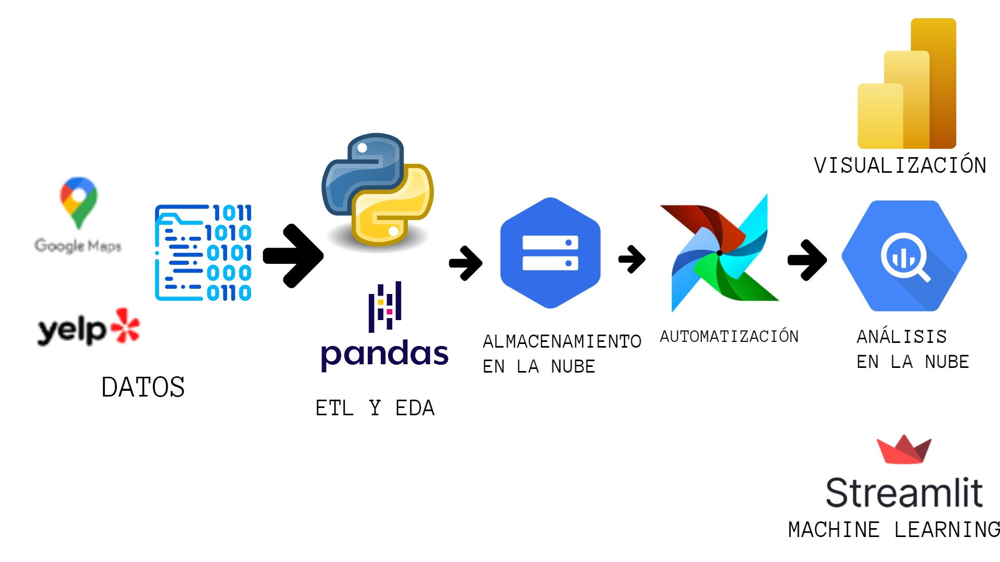

# Proyecto Final - Henry Data Science Bootcamp

## Contexto

"Como parte de una consultora de data, nos han contratado para poder realizar un análisis del mercado estadounidense. Nuestro cliente es parte de un conglomerado de empresas de establecimientos, y desean tener un análisis detallado de la opinión de los usuarios en Yelp y cruzarlos con los de Google Maps sobre hoteles, restaurantes y otros negocios, utilizando análisis de sentimientos, debemos predecir cuáles serán los rubros de los negocios que más crecerán (o decaerán). Además, desean saber dónde es conveniente emplazar los nuevos locales de restaurantes y afines, y desean poder tener un sistema de recomendación de establecimientos para los usuarios de ambas plataformas para darle, al usuario por ejemplo la posibilidad de poder conocer nuevos sabores basados en sus experiencias previas."

## Datos

Los datos utilizados en este proyecto nos fueron proporcionados por Henry:

- **Google Maps**: Se nos proporcionó varios datasets de Google Maps con la información sobre los establecimientos y las reseñas dejadas por los usuarios de Google Maps. [Datasets de Google](https://drive.google.com/drive/folders/1Wf7YkxA0aHI3GpoHc9Nh8_scf5BbD4DA).

- **Yelp**: Al igual que con Google Maps, se nos proporcionó los datasets de Yelp con la información sobre los establecimientos y las reseñas dejadas por sus usuarios. [Datasets de Yelp](https://drive.google.com/drive/folders/1TI-SsMnZsNP6t930olEEWbBQdo_yuIZF)

- **Diccionario de Datos**: Adicionalmente se nos proporcionó un diccionario de datos para fácilitar la comprensión de los mismos. [Diccionario de Datos](https://docs.google.com/document/d/1ASLMGAgrviicATaP1UJlflpmBCXtuSTHQGWdQMN6_2I/edit).

## Repositorio de GitHub

Este repositorio contiene las siguientes carpetas:

- [`Notebooks`](./Notebooks/): Carpeta con los Jupiter Notebooks empleados para hacer los distintos EDA's y limpiezas de datos.
- [`Scripts de SQL`](./SQL/): Carpeta con los scripts de MySQL, empleados para algunas transformaciones de datos y la arquitectura local de la base de datos.
- [`assets`](./assets/): Carpeta con imágenes empleadas en este repositorio.
- [`Datasets`](./Tablas%20csv/): Carpeta con los Datasets ya trabajados para este proyecto.
- [`Modelo ML`](./Modelo%20recomendacion/): Carpeta que contiene el script para correr el siste de recomendación además del notebook que contiene el trabajo de ML para sacar el sentimiento de las reseñas. 
- [`README.md`](./README.md): Este archivo, que proporciona una descripción general del proyecto y sus resultados.

## Objetivo

Basado en la información ofrecida en el contexto, nos propusimos como objetivo entender porque las reseñas y calificaciones de un usuario puede resultar tan útil a la hora de tomar una desición de negocios, dado este predicamento nos pospusimos hacer un análisis y tratamiento exaustivo de los datos que Google Maps y Yelp pusieron a disposición publica, utilizando todo tipo de herramientas para llegar a no solo un entendimiento de estos datos sino a una serie de productos basados en estos datos. Para resumir, nuestra meta se centra principalmente en las reseñas y calificaciones de los usuarios para no solo reconocer la importancia de estos datos sino darles importancia por nuestra cuenta propia.
Objetivos especificos:

- Crear un modelo de machine learning que otorgue el análisis de sentimiento para elaborar un sistema de recomendación basado en este sentimiento para que el usuario introduzca datos como su ciudad y la categoría para que le arroje un resultado de recomendación basado en las reseñas.
- Definir un total de 4 KPI's (Indicadores Clave de Rendimiento) para establecer unas metricas meta en un periodo definido.
- Otorgar un dashboard que pueda dar a entender de una manera visual las conclusiones con respecto al análisis y los KPI's trabajados durante el proyecto.

## Metodología

Para llevar a cabo este proyecto se utilizó la metodología SCRUM que dicta una serie de sprints semanales en las que se establecieron objetivos (hitos) para cada una de las semanas (sprints) para ir trabajando que además serían evaluadas por un SCRUM master en reuniones diarias para asegurar que el grupo de trabajo fuera en la dirección adecuada. Al final de cada sprint se hacía una review y retrospectiva de todo el sprint.
La siguiente gran sección de este repositorio mostrará los hitos más importantes en los que se trabajó durante todos los sprints de manera crónologica:

### Elaborar un Diagrama de Grannt
Se trata de un cronograma que se elaboró en el primer día del proyecto con el fin de organizar todas las tareas del proyecto y cumplir con un plazo determinado por el trabajo y el tiempo de todos los integrantes de este proyecto.
Para este fin utilizamos la herramienta ClickUp para asignar tareas a los días y poder poner anotaciones individuales o en conjunto.

### Carga y limpieza inicial de los datos
Se realizó un proceso de limpieza de datos para preparar los datos antes del análisis. Esto incluyó la extracción de los datos desde las fuentes originales, la limpieza y transformación (ETL) de los mismos para garantizar su calidad y consistencia. El proceso de ETL se encuentra detallado en los archivos de la carpeta Notebook (Para mas información ver el archivo "AboutNotebooks" para aprender más sobre ellos) [`Notebooks`](./Notebooks/).

### Análisis Exploratorio de Datos (EDA)

Se realizó un análisis exhaustivo de los datos utilizando Python y las librerías pandas, numpy, seaborn y matplotlib en varios notebook de Jupyter. Durante este proceso, se llevaron a cabo las siguientes tareas:
- Búsqueda y tratamiento de valores faltantes, atípicos y duplicados.
- Análisis de la distribución de las variables y su relación con los siniestros viales.
- Generación de visualizaciones coherentes para una mejor comprensión de los datos.
- Documentación detallada de los hallazgos y conclusiones en cada etapa del análisis.

El análisis exploratorio de datos se encuentra en la carpeta de Notebooks. [`Notebooks`](./Notebooks/).

### Alcance

Con el fin de aprovechar el tiempo propuesto para este proyecto se ha decidido centrarse en analizar las reseñas de Yelp poder proponer mejoras mas generales al mercado mas no a una cadena y/o servicio especifico. Los objetivos se centrarán principalemente en las categorias de "Food/Restaurants", "Health", "Car Services", "Shopping" y "Hotel". 
Para esto se ha decidido disponer de los siguientes datasets: 
- Google Maps:
1. “metadata-sitios”
Otorga información sobre los comercios con su respectiva localización, categoría y atributos varios
- Yelp: 
1. “business”
Otorga información similar a la de “metadata-sitios” pero en este caso se obtiene la que se encuentra en la base de datos de Yelp. Es un dataset útil para poder relacionarlo al de Google Maps.
2. “reviews”
Otorga la lista de reseñas que les dio a los establecimientos a completo detalle

### KPI's
Se definieron los siguientes KPI's (Indicadores clave de rendimiento), todos tienen como objetivo de tiempo el próximo trimestre:
- KPI 1: Promedio de calificación por comercio
KPI: medir satisfacción general de los clientes
Objetivo: Aumentar 2% la satisfacción general de los clientes.

- KPI 2: N° de reseñas con rating <= a 2 estrellas
KPI: Proporción de reseñas negativas y áreas de mejora.
Objetivo: Disminuir 2% la proporción de reseñas menores a <=2 estrellas.

- KPI 3: Contar la cantidad de calificaciones "Star" dadas en Yelp
KPI: Identificar la relevancia de las calificaciones por estrella y como afectan según que estados del país, además de ver la relación entre una reseña y la calificación.
Objetivo: Contar con al menos 3.8 estrellas de calificación de promedio.

### ETL Completo y creación de base de datos

- Se hizo un ETL completo de los datasets para luego pasarlos a una base de datos local de MySQL. Contando con el hecho de que ya se había hecho una limpieza anterior de los datos no se tardó tanto en este punto. Para más documentación con respecto a este proceso mirar [`Notebooks`](./Notebooks/).

### Estructura de Datos

- Se decidió por usar un DataWarehouse debido a la naturaleza estructurada de los datos.

### Subida de los datos a la nube

- Nos decidimos por utilizar la herramienta de Google Cloud Storage para almacenar nuestra data. Esta desición fue tomada debido a la versatilidad de la herramienta y la cantidad de creditos gratis que otorgaba, pero más importante remarcar la cantidad de API's y herramientas de Google que son facilitadas debido a tener nuestra data almacenada en Cloud Storage como lo es el caso de BigQuery.

### Conexión de Datos a BigQuery

- Se utilizó BigQuery para el análisis de la gran cantidad de datos. Debido a la estructura de nuestra base de datos local nos decidimos por esta herramienta, la cual permitió la implementación mas sencilla de nuestros datos para hacer consultas en la nube.

### Análisis Muestral de Datos y Validación de Datos

- Se hizo un análisis del 10% de los datos más representativos de la base de datos para posteriormente validar la calidad de los datos.

### Automatización y carga incremental

- Se hizo un ETL automatizado para hacer una carga incremental de datos y así enriquecer nuestros datos y los posteriores modelos de machine learning y dashboard.

### Boceto de Dashboard

- Para definir como resultaría la presentación final se requirió hacer un boceto del dashboard final para poder visualizar con anterioridad la información mostrada y los gráficos mostrados.

### MVP del Modelo de Recomendación

- Se hizo un modelo de recomendación preliminar basado en el análisis de sentimiento de las reseñas de Yelp, esto en pos de fundamentar los datos utilizados para este sistema y poder expandir más en un futuro para el producto final. Para ver la demostración de este modelo preliminar dirigirse al siguiente video en la plataforma de Youtube:
[link](https://youtu.be/LlWs4rdgUvs?si=0bMhWxRLQTeBoWXN)

### Modelo ML (Sistema de Recomendación y Deploy)

Se trabajo un modelo de ML para hacer un análisis de sentimiento a todas las reseñas de Yelp para posteriormente realizar el sistema de recomendación basado en el sentimiento resultante usando Streamlit como interfaz para visualizar el sistema.

[link al deploy](http://34.72.77.79:8501)

### Dashboard

El dashboard de este proyecto fue realizado en PowerBI y sirvió con el proposito de hacer una presentación de la parte análitica sobre la información más relevante a nuestro entender, esto incluyendo los KPI's trabajados con anterioridad.

### Video

Un video de demostración del proyecto:

## Conclusiones

  Después de realizar un análisis de nuestros datos una vez que ya se limpiaron y se filtraron, se observaron algunos puntos importantes a mencionar y que sirvieron de ayuda para hacer el sistema de recomendación. A continuación se detallan las conclusiones y puntos a destacar:

  1.- Texas, California y Florida son los estados con más reseñas y negocios presentes en nuestro conjunto de datos de Google; mientras que en Yelp, son los estados de Pensylvania y Florida quienes más reseñas y negocios.

  2.- La categoría de Food/Restaurant tiene más presencia en los dos conjuntos de datos, es decir, cuenta con más reseñas y más negocios, caso contrario a Hotel, que tiene una cantidad menor.

  3.- Se destaca la presencia de negocios de cadena de comida rápida como Mc´Donalds, Chick-fil-A y Wendy´s como los negocios con más reseñas en esta variable (Negocios).

  Dicho lo anterior, se observa que, en hay una diferencia de estados en los dos conjuntos de datos, sin embargo, hay uno que si está presente en los dos y es Florida, esto nos puede decir que en ese estado los clientes de los negocios dejen más reseñas que el cualquiero otro estado del país incluso los ya mencionados en el punto 3. Por otra parte, negocios con menos reseñas son los que tienen menos calificación promedio, esto nos puede decir dos cosas, la primera es que sus clientes dejen menos reseñas y la segunda es que esas reseñas sean de baja puntuación y puedan estar bajando el promedio de calificación por negocio. Estados como South Dakota, Montana, Delaware y Maryland el número de negocios son correlacionales, es decir, al no haber una cantidad de negocios, hay un número muy poco siginificativo de reseñas, por ende, estos estados son candidatos a estudio posterior para saber más acera de su demografía, densidad de población, etc. Finalmente, también se puede hacer un estudio de por qué los clientes prefieren dejar reseñas en negocios más conocidos y no tanto en negocios más pequeños o que no son de cadena; todo esto puede ayudar a obtener resultados más profundos del análisis, sin embargo, estos puntos destacados son de gran de utilidad para entender el mercado de negocios y con eso realizar el sistema de recomedación.

## Stack de Tecnologias

- Visual Studio Code
- Python (Incluye las librerias: Numpy, Pandas, Matplotlib, Seaborn, SK Learn, TextBlob, VADER entre otros)
- ClickUp
- Google Cloud Storage & Google BigQuery
- Git y GitHub
- Canva
- Streamlit
- PowerBI

## Autores

Este proyecto fue desarrollado por las siguientes personas:

Fernando Sanchez Barrera - Data Engineering & Machine Learning
- GitHub: [https://github.com/FSanchezB](https://github.com/FSanchezB)
- Correo electrónico: [fernandosb0320@gmail.com](mailto:fernandosb0320@gmail.com)

Erick Daniel Romero - Data Analytics & Data Science
- GitHub: [https://github.com/erickdrl](https://github.com/erickdrl)
- Correo electrónico: [erick3728@gmail.com](mailto:erick3728@gmail.com)

Fabián Rodríguez - Data Engineering & Data Analytics
- GitHub: [https://github.com/farodd](https://github.com/farodd)
- Correo electrónico: [farodriguezorellana@gmail.com](mailto:farodriguezorellana@gmail.com)

Miguel Ángel Jaramillo - Data Science & Machine Learning
- GitHub: [https://github.com/MAngelJaramillo](https://github.com/MAngelJaramillo)
- Correo electrónico: [miguelangelgomezj@gmail.com](mailto:miguelangelgomezj@gmail.com)
